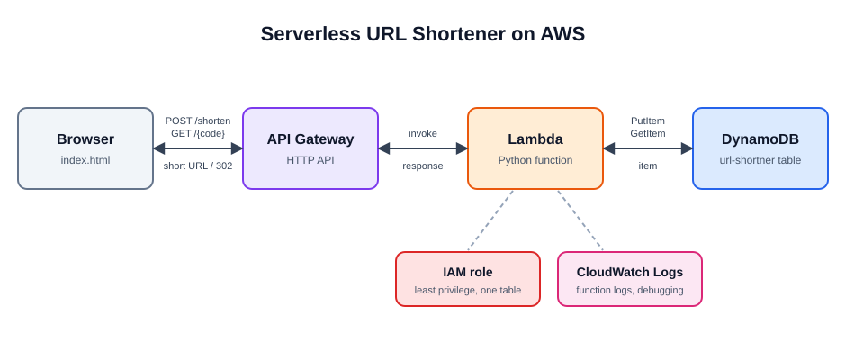
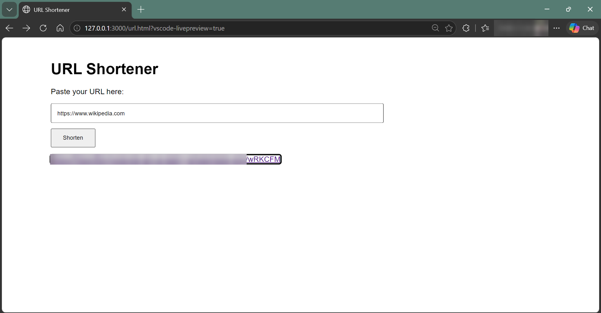
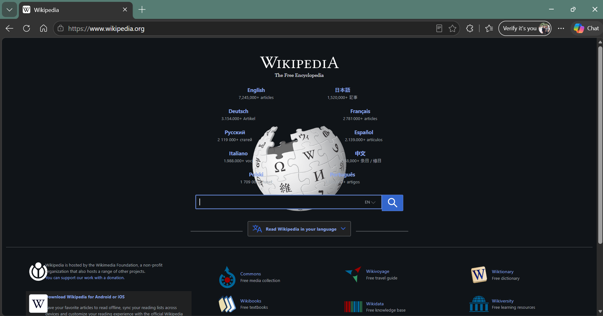
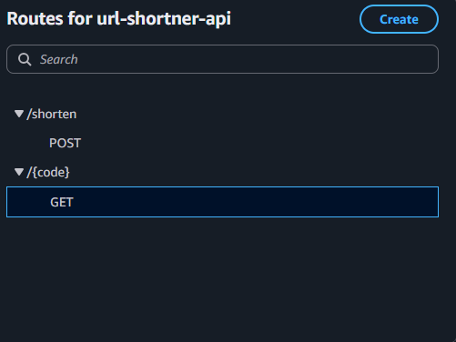
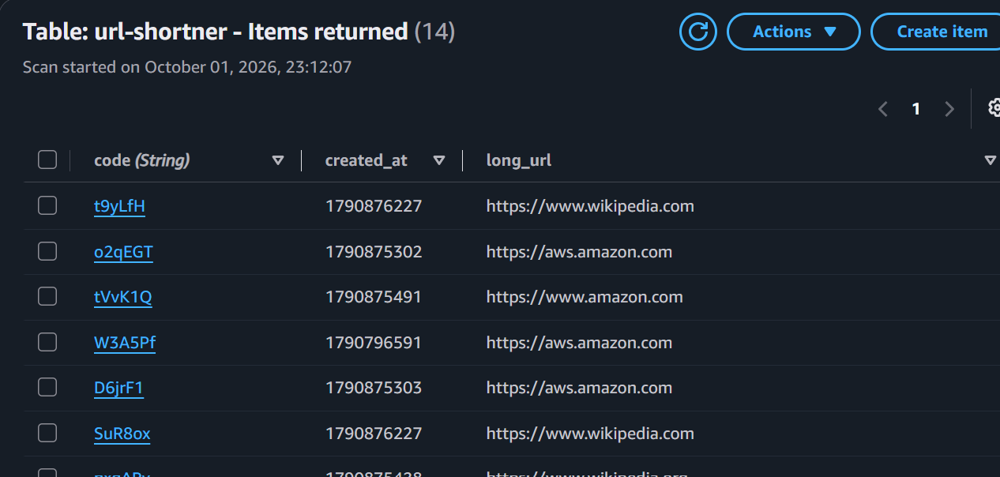

# Serverless URL Shortener on AWS

A serverless web app that turns long URLs into short links and redirects visitors to the original page. This is my first AWS project, built after completing AWS Cloud Practitioner Essentials. I built it by hand in the AWS console first, then rebuilt the whole backend with Terraform.



## Demo

 

### Demo video

[Watch: rebuilding the whole stack with Terraform (destroy → apply → test)](https://drive.google.com/file/d/1I4IDfQNHo6E3B0wUnGzPFYJjtkPSdi39/view?usp=drive_link)

The video shows the same architecture deployed with `terraform apply` and tested directly against the API with PowerShell (no web page). It ends with a short link redirecting to the original site.

## How it works

1. The user submits a URL on the web page (or sends it straight to the API).
2. `POST /shorten` validates the URL, generates a random 6-character code, and saves it in DynamoDB. A conditional write prevents duplicate codes.
3. Opening `/{code}` looks up the original URL and returns an HTTP 302 redirect.

## AWS services used

| Service | Role |
| --- | --- |
| API Gateway (HTTP API) | Exposes `POST /shorten` and `GET /{code}` |
| Lambda (Python 3.12) | Generates codes, stores links, performs redirects |
| DynamoDB | Stores code → long URL (on-demand capacity) |
| IAM | Least-privilege policy: only `PutItem` and `GetItem` on one table |
| CloudWatch Logs | Debugging and monitoring |



*API Gateway routes.*



*Links stored in the `url-shortner` table.*

## Infrastructure as Code (Terraform)

After building the project in the console, I recreated the backend with Terraform so the whole stack can be deployed and removed with one command. It creates 11 resources in `us-east-1`: the DynamoDB table, the Lambda function and its IAM role and policy attachments, the API Gateway HTTP API with its integration, routes and stage, and the Lambda invoke permission.

```bash
cd terraform
terraform init
terraform apply     # builds everything and prints api_url
terraform destroy   # removes everything
```

Test the deployed API (PowerShell):

```powershell
Invoke-RestMethod -Method Post -Uri "<api_url>" `
  -ContentType "application/json" `
  -Body '{"url": "https://example.com"}'
```

The response contains a `short_code`. Open `<api_url>/<short_code>` in a browser and it redirects to the original URL.

## Security and cost

- IAM role scoped to a single DynamoDB table
- Input validation: http/https only, maximum length, empty-code check
- CORS configured for the browser frontend
- AWS Budgets alert set up; serverless services keep idle cost near zero

## Challenges and what I learned

- **IAM `AccessDeniedException`:** the policy's table ARN didn't match my table name. I found it by reading CloudWatch logs and fixed the policy.
- **DynamoDB `ValidationException`:** opening the bare API address sent an empty code to `GetItem`. I added an input check that returns a clean 400 error.
- **Frontend debugging:** JavaScript displayed as text because it wasn't inside a `<script>` tag.
- **Terraform:** I had never used infrastructure as code before this. Rebuilding the stack from scratch showed me how the pieces depend on each other: the Lambda permission and the API integration have to exist before the API can invoke the function, and destroy takes longest on those and the DynamoDB table.

## Project structure

```
url.html                 Frontend
lambda_function.py       Backend logic (Lambda handler)
iam-policy.json          IAM policy (account ID redacted)
terraform/main.tf        Terraform version of the backend
architecture.svg         Architecture diagram
*.png                    Screenshots
```

## Possible improvements

- Put CloudFront in front of the API
- Add a custom domain
- Add expiring links
